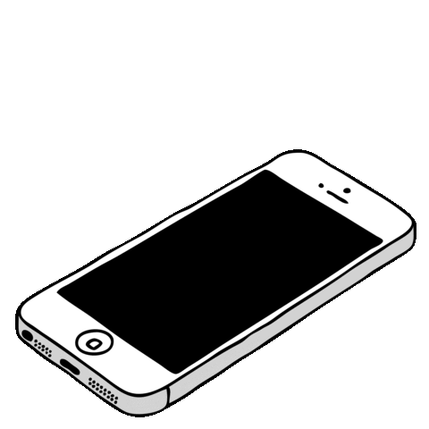

    

 

	
## <picture></picture> **About me**

<picture>
  <source media="(max-width: 767px)" srcset="">
  
</picture>

 

- Hello, and welcome to my GitHub profile! My name is Phan Anh Tu, and I am curently a Computer Science student with a passion for creating engaging and user-friendly web applications. 

- Currently, I am pursuing a Bachelor's degree in Computer Science, where I am also learning and expanding my knowledge in software development.

- My ultimate goal is to create innovative and user-friendly web applications that provide real value to users.

- I am always open to new ideas and opportunities to collaborate with other passionate developers. If you're interested in discussing potential projects or just want to say hello, feel free to reach out to me at <a href="mailto:hungnbc2@gmail.com">hungnbc2@gmail.com</a>

- Thank you for visiting my profile, and I look forward to connecting with you!

  

  

## <picture></picture> **Skills**
 

 

- **Languages**:

    &nbsp;
    &nbsp;
    &nbsp;

 

    
    
- **Front-End Development**:

   &nbsp;

 

 

- **Cloud Hosting**:

    
    
    
 

 

- **Softwares and Tools**:

    &nbsp;
    &nbsp;
    &nbsp;
    &nbsp;

 

## <picture></picture> **Contacts**

 

## <picture></picture> **GitHub Stats**

  
|  |  |
| ------------- | ------------- |

## <picture></picture> **Q&A!!**

## <picture></picture> **GitHub Summary**

	<picture>
	  <source media="(prefers-color-scheme: dark)"  srcset="https://raw.githubusercontent.com/BlackRose484/BlackRose484/ouput-3d-contrib/night.svg" />
	  <source media="(prefers-color-scheme: light)" srcset="https://raw.githubusercontent.com/BlackRose484/BlackRose484/ouput-3d-contrib/day.svg" />
	  
	</picture>

## <picture></picture> **Top Repositories**

 
 

## Donation 🥰 
If you like what i do, maybe consider buying me a coffee/tea 🥺👉👈

